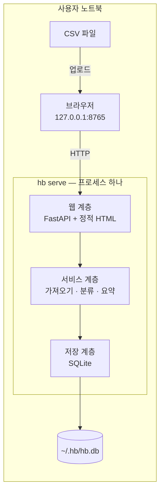

# 인프라 아키텍처

## 0. 이 문서가 다루는 것

이 도구가 어디서 어떻게 돌아가는지 — 제약, 구성, 기술 스택, 데이터가 사는 곳. 클래스와 함수는 6·10단계, 화면은 7단계에서 다룬다. 서버 한 프로세스와 브라우저 하나뿐인 작은 구성이므로 배치·운영 절도 짧다.

## 1. 제약

#### C1 네트워크 호출 없음

출처: [[HB-PRD-001#R6]] · [[HB-PRD-001#G2]]

애플리케이션 코드에 외부 HTTP·DNS 호출이 없다. 의존 패키지도 실행 중 네트워크를 쓰지 않는 것만 고른다. 통합 테스트에서 소켓을 막고 전부 통과해야 한다.

#### C2 데이터는 파일 하나

출처: [[HB-PRD-001#R6]]

거래·규칙·가져오기 이력 전부 SQLite 파일 하나(`~/.hb/hb.db`)에 산다. 이 파일을 복사하면 이주가 끝난다.

#### C3 설치는 명령 하나, 실행도 명령 하나

출처: [[HB-PRD-001#R6]] · [[HB-RFQ-001#Q5]]

`pipx install hb` 또는 `uv tool install hb`로 설치, `hb serve`로 실행. 실행하면 브라우저가 `http://127.0.0.1:8765`로 열린다. 로컬 루프백에만 바인딩한다.

#### C4 300건 가져오기 2초

출처: [[HB-PRD-001#R1]]

파일 하나 300건을 읽고 지문 검사·분류·저장까지 2초 안. 규칙 수천 개까지는 메모리 안에서 찾는다.

#### C5 인코딩 UTF-8·CP949 둘 다

출처: [[HB-PRD-001#R1]]

국내 은행·카드사 CSV는 CP949가 흔하다. BOM 유무와 두 인코딩을 자동 판별한다.

## 2. 구성도



## 3. 기술 스택

| 층 | 선택 | 이유 |
|---|---|---|
| 언어 | Python 3.12 | CSV·인코딩 처리가 표준 라이브러리로 되고, 개인 도구로 가장 빨리 만든다 |
| 웹 | FastAPI + uvicorn | 작은 REST와 정적 파일 서빙. 비동기 필요 없음 |
| 화면 | 서버가 주는 정적 HTML + 최소 JS(fetch) | 빌드 도구 없이 파일 하나. 프레임워크 없음 |
| DB | SQLite (표준 `sqlite3`) | C2. ORM 없이 SQL 직접 |
| CSV | 표준 `csv` + `charset` 판별은 BOM·디코딩 시도 순서로 | C5, 의존 최소 |
| 테스트 | pytest | — |
| 패키징 | pyproject + pipx/uv | C3 |

## 4. 내부 구조

```
hb/
  main.py          # hb serve 진입, uvicorn 기동, 브라우저 열기
  web/             # REST 라우터, 정적 파일
  service/         # ImportService · ClassifyService · RuleService · SummaryService
  domain/          # Transaction · Rule · Category · ImportProfile (6단계)
  infra/           # SQLite 저장소, CSV 리더, 프로파일 정의
  static/          # index.html, app.js, style.css
tests/
```

계층은 위에서 아래로만 부른다: web → service → domain/infra. domain은 아무것도 import하지 않는다.

## 5. 인증과 접근

없다. 루프백에만 바인딩하고(C3) 사용자는 한 명이다([[HB-PRD-001#N2]]). 다른 기기에서 접근하는 것은 지원하지 않는다.

## 6. 데이터가 사는 곳

| 데이터 | 어디 | 비고 |
|---|---|---|
| 거래·규칙·가져오기 이력 | `~/.hb/hb.db` (SQLite) | C2 |
| 가져오기 프로파일(기관별 컬럼 매핑) | 코드 안 `infra/profiles.py` | 사용자가 고치는 것이 아니라 개발자가 추가한다 |
| 항목 목록 11개 | 코드 안 상수 | [[HB-PRD-001#R3]] |
| 올린 CSV 원본 | 저장하지 않는다 | 읽고 버린다. 원문 적요는 거래 행에 남는다 |
| 로그 | stdout | 파일 로그 없음 |

## 7. 외부 변경 감지

없다. 외부 시스템이 없다(C1). 은행·카드사 형식이 바뀌면 프로파일 판별이 실패하고 UC-H1 확장 2a로 드러난다.

## 8. 배치와 운영

- 설치: `pipx install hb` · 실행: `hb serve` · 종료: Ctrl-C
- 백업: `~/.hb/hb.db` 파일 복사
- 업그레이드: `pipx upgrade hb`. 스키마 변경은 기동 시 마이그레이션 스크립트가 순서대로 적용한다(`schema_version` 테이블)
- 모니터링·알림: 없다

## 9. 미결사항

- [ ] 카드 2곳의 실제 CSV 헤더 확보(프로파일 채우기 전제)
- [ ] Windows에서 `~/.hb` 경로 규칙(`%USERPROFILE%\.hb`)으로 통일할지
