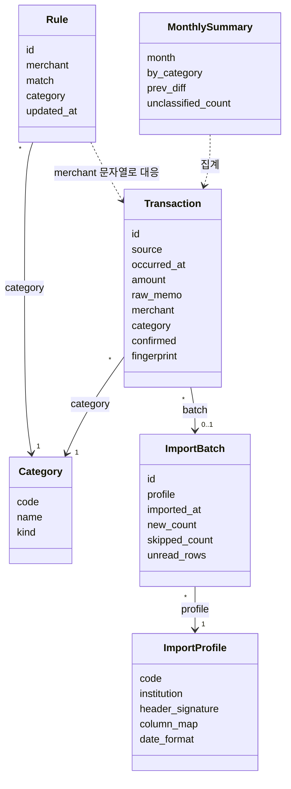

# 도메인 모델

## 0. 이 문서가 다루는 것

이 도구가 다루는 개념과 그 사이 관계. 클래스 명세(HB-DOM-002)는 8단계 API 뒤에, ERD·DD(HB-DOM-003)는 클래스 명세 뒤에 따로 쓴다. 여기서는 개념의 이름·속성·관계·판정 근거만 정한다. 개념 영문명이 곧 클래스명이고, 테이블명은 그 소문자 복수형이다.

## 1. 개념 식별

| 개념 | 영문명 | 왜 개념인가 | 출처 |
|---|---|---|---|
| 거래 | Transaction | 가져온 한 줄. 모든 것의 중심 | [[HB-PRD-001#R1]] · [[HB-PRD-001#R2]] |
| 항목 | Category | 거래에 붙는 분류. 11개 고정 | [[HB-PRD-001#R3]] |
| 분류 규칙 | Rule | 가맹점명 → 항목. 사람이 만든 지식 | [[HB-PRD-001#R3]] · [[HB-PRD-001#R4]] |
| 가져오기 프로파일 | ImportProfile | 기관별 CSV 형식 | [[HB-PRD-001#R1]] |
| 가져오기 | ImportBatch | 파일 하나를 넣은 사건과 그 결과 | [[HB-UC-001#UC-H1]] |
| 월 요약 | MonthlySummary | 계산 결과. 저장하지 않는 값 객체 | [[HB-PRD-001#R5]] |

개념이 아닌 것: 「사용자」 — 한 명뿐이라 모델에 없다([[HB-PRD-001#N2]]). 「가맹점」 — 별도 개체가 아니라 거래의 정규화 문자열(`merchant`)이다. 규칙이 그 문자열을 키로 쓴다.

## 2. 개념 모델

## 3. 개념별 정리

#### Transaction 거래

| 속성 | 뜻 | 근거 |
|---|---|---|
| source | 기관 코드(bank_a · card_b · card_c) | [[HB-PRD-001#R1]] |
| occurred_at | 거래 일시 | — |
| amount | 원 단위 정수. 지출 음수·수입 양수. 취소는 원 거래의 반대 부호 | [[HB-PRD-001#R7]] |
| raw_memo | CSV 적요 원문. 바꾸지 않는다 | [[HB-PRD-001#R2]] |
| merchant | raw_memo를 정규화한 가맹점명. 규칙의 키 | [[HB-UC-001#UC-S1]] |
| category | 붙은 항목. 없으면 `uncategorized` | [[HB-PRD-001#R3]] |
| confirmed | 사람이 「이 건만」으로 직접 정했으면 참. 참이면 규칙 변경이 덮어쓰지 않는다 | [[HB-PRD-001#R4]] |
| fingerprint | sha256(source, occurred_at, amount, raw_memo). 유일 | [[HB-PRD-001#R2]] |

판정: 같은 fingerprint가 있으면 새 거래가 아니다. `confirmed`가 참이면 Rule이 바뀌어도 category는 그대로다.

#### Category 항목

고정 11개. 코드는 영문 소문자, 이름은 한글, kind는 지출·수입·이체·미분류 중 하나.

| code | 이름 | kind |
|---|---|---|
| food | 식비 | 지출 |
| transport | 교통 | 지출 |
| housing | 주거 | 지출 |
| telecom | 통신 | 지출 |
| medical | 의료 | 지출 |
| culture | 문화 | 지출 |
| shopping | 쇼핑 | 지출 |
| transfer | 이체 | 이체 |
| income | 수입 | 수입 |
| etc | 기타 | 지출 |
| uncategorized | 미분류 | 미분류 |

근거: [[HB-PRD-001#R3]]. 이체는 지출 합계에서 뺀다([[HB-PRD-001#R5]]).

#### Rule 분류 규칙

| 속성 | 뜻 |
|---|---|
| merchant | 정규화한 가맹점명 또는 그 일부 |
| match | `exact` 또는 `contains` |
| category | 붙일 항목 |
| updated_at | 마지막으로 사람이 정한 때 |

판정: 정확 일치가 포함보다 먼저, 포함끼리는 긴 merchant가 먼저([[HB-UC-001#UC-S1]]). 사람이 UC-H2·UC-H3에서 만드는 규칙은 항상 `exact`다. `contains` 규칙은 첫 버전에서는 기본 제공(예: 「택시」→교통)만 있다.

#### ImportProfile 가져오기 프로파일

| 속성 | 뜻 |
|---|---|
| code | bank_a · card_b · card_c |
| header_signature | 헤더 행에 반드시 있어야 하는 컬럼 이름 집합. 판별 기준 |
| column_map | 일시·금액·적요·(취소 표시) 컬럼 이름 |
| date_format | 날짜 파싱 형식 |

코드 상수다. 저장하지 않는다([[HB-INFRA-001#C2]]의 예외 — 개발자가 고친다).

#### ImportBatch 가져오기

파일 하나를 넣은 사건. new_count·skipped_count·unread_rows(읽지 못한 행 번호 목록)를 남긴다. 거래는 자기가 들어온 batch를 가리킨다(되돌리기의 단서. 첫 버전에는 되돌리기 없음).

#### MonthlySummary 월 요약

저장하지 않는 계산 결과. `by_category`는 항목별 합계, `prev_diff`는 전월이 있을 때만 채운다([[HB-PRD-001#R5]]).

## 4. 경계

- 이 도구 밖: 은행·카드사 시스템, 파일 다운로드 행위. 파일이 들어온 뒤부터가 도메인이다.
- 도메인 안에서 「가맹점」은 개체가 아니라 문자열 정규화 규칙이다. 정규화 함수가 바뀌면 기존 거래의 `merchant`를 다시 계산해야 한다 — 미결.

## 5. 미결사항

- [ ] 정규화 규칙(지점명 제거 등)이 바뀌었을 때 기존 거래 merchant 재계산을 어떻게 할지
- [ ] `contains` 규칙을 사람이 만들 수 있게 할지(첫 버전은 exact만)
