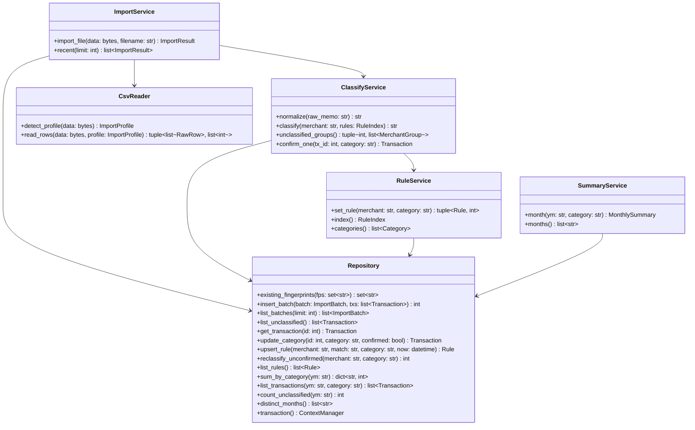

# 클래스 명세

## 0. 이 문서가 다루는 것

도메인 모델([[HB-DOM-001#Transaction]] 등)을 코드로 옮길 때의 클래스와 그 공개 메서드. API([[HB-API-001#POST/api/imports]] 등)가 확정된 뒤에 쓴다. 메서드 하나하나의 처리는 10단계 MINISPEC이 맡는다 — 여기서는 시그니처와 책임·의존만. 절 하나가 파일 하나다([[HB-INFRA-001#C2]]의 내부 구조).

## 1. 개념 식별

| 클래스 | 파일 | 층 | 개념 |
|---|---|---|---|
| Transaction · Rule · Category · ImportProfile · ImportBatch · MonthlySummary | `hb/domain/models.py` | domain | [[HB-DOM-001#Transaction]] 등 그대로. dataclass |
| ImportService | `hb/service/import_service.py` | service | 가져오기 |
| ClassifyService | `hb/service/classify_service.py` | service | 분류·확정 |
| RuleService | `hb/service/rule_service.py` | service | 규칙·항목 |
| SummaryService | `hb/service/summary_service.py` | service | 월 요약 |
| CsvReader | `hb/infra/csv_reader.py` | infra | 파일 읽기 |
| Repository | `hb/infra/repo.py` | infra | SQLite 접근 |

## 2. 개념 모델

## 3. 개념별 정리

#### ImportService 가져오기 서비스

책임: 파일 바이트 → 거래 저장까지 한 흐름(9단계 SEQ-1에서 그린다). 의존: CsvReader · ClassifyService · Repository. 상태 없음. 라우터 [[HB-API-001#POST/api/imports]] · [[HB-API-001#GET/api/imports]]가 부른다.

#### ClassifyService 분류 서비스

책임: 정규화·규칙 적용·미분류 묶기·한 건 확정. 의존: RuleService(인덱스) · Repository. `normalize`·`classify`는 순수 함수라 도메인에 둘 수도 있지만 규칙 인덱스를 받는 편의로 서비스에 둔다. 라우터 [[HB-API-001#GET/api/unclassified]] · [[HB-API-001#PATCH/api/transactions/{id}]].

#### RuleService 규칙 서비스

책임: 규칙 upsert + 미확정 재분류를 한 트랜잭션으로. 항목 상수 제공. 의존: Repository. 라우터 [[HB-API-001#PUT/api/rules/{merchant}]] · [[HB-API-001#GET/api/categories]].

#### SummaryService 요약 서비스

책임: 읽기 전용 집계. 의존: Repository. 라우터 [[HB-API-001#GET/api/months/{ym}]] · [[HB-API-001#GET/api/months]].

#### CsvReader CSV 리더

책임: 인코딩 판별([[HB-INFRA-001#C5]])·프로파일 판별·행 파싱·취소 부호. 의존: `infra/profiles.py` 상수(`PROFILES: list[ImportProfile]`). 네트워크·DB 없음.

#### Repository 저장소

책임: SQLite 접근 전부. SQL은 여기에만 있다. `transaction()`은 컨텍스트 매니저로 BEGIN/COMMIT/ROLLBACK. 테이블은 ERD(HB-DOM-003, 뒤에)에서 정한다. 의존: 표준 `sqlite3`.

#### Transaction 거래 (도메인 dataclass)

`from_row(row: RawRow, source: str, normalize) -> Transaction` 클래스 메서드 하나. fingerprint = sha256(`f"{source}|{occurred_at}|{amount}|{raw_memo}"`). 나머지 속성은 [[HB-DOM-001#Transaction]] 그대로.

## 4. 경계

- 라우터(`hb/web/`)는 클래스가 아니라 함수 모음이다. 요청을 풀고 서비스를 부르고 예외를 HTTP 코드로 바꾸는 것만 한다([[HB-API-001#POST/api/imports]]의 400 등).
- 서비스는 서로 Repository를 공유한다(생성자 주입). 서비스끼리 직접 부르는 것은 ImportService → ClassifyService, ClassifyService → RuleService 둘뿐.

## 5. 미결사항

- [ ] Repository를 하나로 둘지 도메인별로 쪼갤지 — 메서드 14개라 하나로 두고, 20개를 넘으면 쪼갠다
