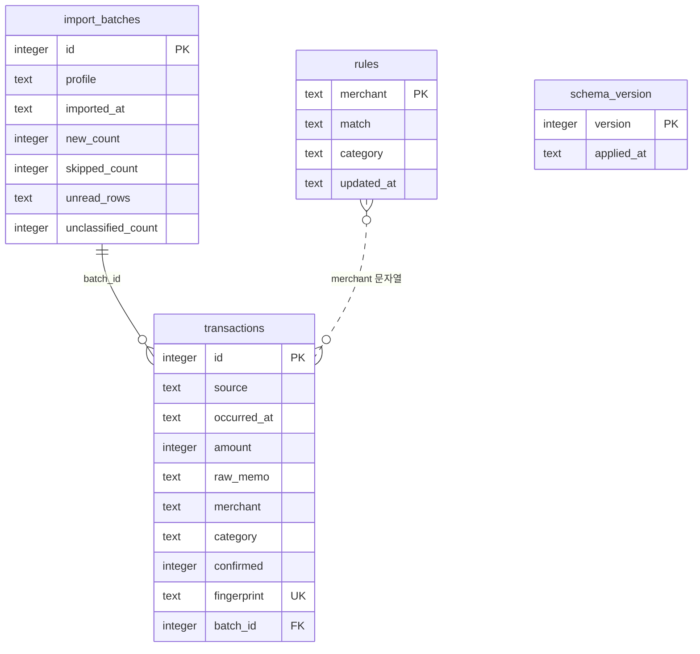

# ERD·DD

## 0. 이 문서가 다루는 것

SQLite 파일 하나([[HB-INFRA-001#C2]]) 안의 테이블. 클래스 명세([[HB-DOM-002#Repository]])가 확정된 뒤에 쓴다. 테이블명은 개념 영문명의 소문자 복수형. 저장하지 않는 개념(Category·ImportProfile·MonthlySummary)은 테이블이 없다.

## 1. 개념 식별

| 개념 | 테이블 | 저장하나 |
|---|---|---|
| [[HB-DOM-001#Transaction]] | transactions | 예 |
| [[HB-DOM-001#Rule]] | rules | 예 |
| [[HB-DOM-001#ImportBatch]] | import_batches | 예 |
| [[HB-DOM-001#Category]] | — | 코드 상수. 테이블에는 코드 문자열만 |
| [[HB-DOM-001#ImportProfile]] | — | 코드 상수 |
| [[HB-DOM-001#MonthlySummary]] | — | 계산 결과 |
| 스키마 버전 | schema_version | 예(마이그레이션용) |

## 2. 개념 모델

## 3. 개념별 정리

#### transactions 거래

| 컬럼 | 형 | 제약 | 뜻 |
|---|---|---|---|
| id | INTEGER | PK AUTOINCREMENT | — |
| source | TEXT | NOT NULL | 기관 코드 bank_a · card_b · card_c |
| occurred_at | TEXT | NOT NULL | `YYYY-MM-DD` |
| amount | INTEGER | NOT NULL | 원. 지출 음수 |
| raw_memo | TEXT | NOT NULL | 적요 원문 |
| merchant | TEXT | NOT NULL | 정규화 가맹점명 |
| category | TEXT | NOT NULL DEFAULT 'uncategorized' | 항목 코드 |
| confirmed | INTEGER | NOT NULL DEFAULT 0 | 0/1 |
| fingerprint | TEXT | NOT NULL UNIQUE | sha256 hex |
| batch_id | INTEGER | FK import_batches(id) | — |

인덱스: `(occurred_at)` 월 조회 · `(merchant, confirmed)` 재분류 · `(category, occurred_at)` 항목 필터. 근거: [[HB-PRD-001#R2]](UNIQUE fingerprint) · [[HB-PRD-001#R4]](confirmed).

#### rules 분류 규칙

| 컬럼 | 형 | 제약 | 뜻 |
|---|---|---|---|
| merchant | TEXT | PK | 정규화 가맹점명(또는 일부) |
| match | TEXT | NOT NULL CHECK IN ('exact','contains') | — |
| category | TEXT | NOT NULL | 항목 코드. uncategorized 금지는 서비스가 막는다 |
| updated_at | TEXT | NOT NULL | ISO 8601 |

merchant가 PK이므로 exact와 contains가 같은 문자열을 가질 수 없다 — 첫 버전에서는 문제 없음. 근거: [[HB-PRD-001#R3]].

#### import_batches 가져오기

| 컬럼 | 형 | 제약 | 뜻 |
|---|---|---|---|
| id | INTEGER | PK AUTOINCREMENT | — |
| profile | TEXT | NOT NULL | 프로파일 코드 |
| imported_at | TEXT | NOT NULL | ISO 8601 |
| new_count | INTEGER | NOT NULL | — |
| skipped_count | INTEGER | NOT NULL | — |
| unread_rows | TEXT | NOT NULL DEFAULT '[]' | JSON 배열 |
| unclassified_count | INTEGER | NOT NULL | 저장 시점 값 |

#### schema_version 스키마 버전

| 컬럼 | 형 | 제약 | 뜻 |
|---|---|---|---|
| version | INTEGER | PK | 1부터 |
| applied_at | TEXT | NOT NULL | — |

기동 시 최대 version보다 큰 마이그레이션을 순서대로 적용한다([[HB-INFRA-001#C3]]의 업그레이드).

## 4. 경계

- 항목 코드는 FK가 아니라 문자열이다. 항목이 코드 상수이므로 DB가 검증하지 않는다 — 서비스가 막는다([[HB-DOM-002#RuleService]]).
- 파일 원본은 저장하지 않는다([[HB-INFRA-001#C2]]의 표).

## 5. 미결사항

- [ ] occurred_at에 시각까지 넣을지(은행은 시각이 있고 카드는 날짜만) — 첫 버전은 날짜만
