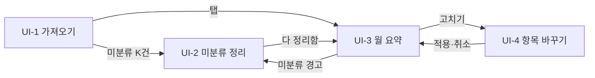

# 화면 설계·와이어프레임 — 가계부 자동 분류

## 0. 이 문서가 다루는 것

브라우저에서 보이는 화면 넷의 목록·흐름·배치·요소·규칙. 한 문서에 화면 설계와 와이어프레임을 같이 쓴다. 화면은 서버가 주는 정적 HTML 하나에 탭처럼 붙는다([[HB-INFRA-001#C3]]). 배치는 디자인 도구로 만든 자기 완결 html(색·폰트 포함)을 그대로 넣은 것이다([[SYNC-STD-001]] 2.7).

## 1. 유스케이스 대응

| 유스케이스 | 화면 |
|---|---|
| [[HB-UC-001#UC-H1]] | UI-1 |
| [[HB-UC-001#UC-H2]] | UI-2 |
| [[HB-UC-001#UC-H3]] | UI-3 · UI-4 |
| [[HB-UC-001#UC-H4]] | UI-3 |

## 2. 화면 목록

| 화면 | 경로 | 한 줄 목적 |
|---|---|---|
| UI-1 가져오기 | `/` | CSV를 놓고 결과 건수를 본다 |
| UI-2 미분류 정리 | `/#unclassified` | 가맹점 묶음마다 항목을 고른다 |
| UI-3 월 요약 | `/#month/{ym}` | 항목별 합계·증감·목록을 본다 |
| UI-4 거래 항목 바꾸기 | (UI-3 위의 대화상자) | 한 건을 고치거나 규칙째 바꾼다 |

## UI-1 가져오기

| 항목 | 내용 |
|---|---|
| 경로 | `/` |
| 주 유스케이스 | [[HB-UC-001#UC-H1]] |
| 진입 / 이탈 | 도구를 켜면 첫 화면 / 결과의 「미분류 K건」을 누르면 UI-2, 상단 탭으로 UI-3 |

### 배치
```html
<style>
/* UI-1 가져오기 */
.cols{display:flex;gap:24px;min-height:0}
.col-main{flex:1;min-width:0;display:flex;flex-direction:column;gap:20px}
.col-side{width:380px;flex:none}
.dropzone{display:flex;flex-direction:column;align-items:center;gap:8px;padding:36px 32px 32px;text-align:center;border:1.5px dashed var(--rule);background:transparent}
.dropzone svg{width:32px;height:32px;stroke:var(--accent);fill:none;stroke-width:1.6;stroke-linecap:round;stroke-linejoin:round;margin-bottom:4px}
.dz-title{font-family:"Gowun Batang",serif;font-size:22px;font-weight:700}
.dz-sub{font-size:14px;color:var(--soft);max-width:520px;margin-bottom:10px}
.result{padding:18px 20px 20px;display:flex;flex-direction:column;gap:14px}
.res-head{display:flex;align-items:baseline;gap:12px;font-size:13px}
.res-label{font-weight:600;color:var(--accent)}
.res-file{color:var(--soft)}
.golink{align-self:flex-start;display:inline-flex;align-items:center;gap:8px;height:40px;padding:0 14px;border-radius:8px;background:var(--warn-bg);color:var(--warn);font-weight:600;text-decoration:none;font-size:14.5px}
.golink:hover{color:var(--warn)}
.error{padding:16px 20px;border-color:var(--warn-line);background:var(--warn-bg);display:flex;flex-direction:column;gap:6px}
.err-title{font-weight:600;color:var(--warn)}
.err-sub{font-size:13.5px;color:var(--ink)}
.error pre{margin:6px 0 0;padding:10px 12px;background:var(--card);border:1px solid var(--warn-line);border-radius:6px;font:13px/1.5 ui-monospace,SFMono-Regular,Menlo,monospace;overflow:hidden}
.history{padding:6px 0 4px}
.history h3{font-size:14px;font-weight:600;margin:10px 18px 6px;color:var(--soft)}
</style>
<div class="hb" lang="ko">
  <header class="topbar" data-el="1">
    <div class="brand" data-el="2">가계부 자동 분류<small>내 컴퓨터에서만</small></div>
    <nav class="tabs" data-el="3" aria-label="화면">
      <a href="#" class="on" aria-current="page">가져오기</a>
      <a href="#unclassified">미분류 <span class="cnt">9</span></a>
      <a href="#month/2026-10">월 요약</a>
    </nav>
  </header>
  <main class="page">
    <div class="cols">
      <div class="col-main">
        <section class="dropzone card" data-el="4" aria-label="파일 놓는 곳">
          <svg viewBox="0 0 24 24" aria-hidden="true"><path d="M12 16V4M6 10l6-6 6 6"/><path d="M4 16v3a1 1 0 0 0 1 1h14a1 1 0 0 0 1-1v-3"/></svg>
          <div class="dz-title">CSV 파일을 여기에 놓으세요</div>
          <div class="dz-sub">은행 A · 카드 B · 카드 C 파일을 헤더로 알아봅니다. 놓으면 바로 가져오고, 이미 있는 거래는 건너뜁니다.</div>
          <button class="btn" type="button" data-el="5">파일 고르기</button>
        </section>
        <section class="result card" data-el="6" aria-label="가져오기 결과">
          <div class="res-head"><span class="res-label">방금 가져옴</span><span class="res-file">card_b_2026-10.csv · 10-02 21:10</span></div>
          <div class="stats" data-el="7">
            <div class="stat"><div class="k">형식</div><div class="v">카드 B</div></div>
            <div class="stat"><div class="k">새로 들어온</div><div class="v">138<span class="u">건</span></div></div>
            <div class="stat"><div class="k">건너뛴</div><div class="v">0<span class="u">건</span></div></div>
            <div class="stat"><div class="k">읽지 못한 행</div><div class="v">0<span class="u">건</span></div></div>
          </div>
          <a class="golink" data-el="8" href="#unclassified">미분류 4건 정리하기 <span aria-hidden="true">→</span></a>
        </section>
        <div class="alt">
          <div class="alt-cap">판별 실패 때 — 결과(6) 자리에 이것이 보이고, 거래는 하나도 저장되지 않는다</div>
          <section class="error card" data-el="9" role="alert">
            <div class="err-title">어느 기관 파일인지 모르겠습니다</div>
            <div class="err-sub">헤더 행이 은행 A · 카드 B · 카드 C 어느 형식과도 맞지 않습니다.</div>
            <pre data-el="10">거래일자,적요,출금액,입금액,잔액</pre>
          </section>
        </div>
      </div>
      <aside class="col-side">
        <section class="history card" data-el="11">
          <h3>최근 가져오기</h3>
          <table class="grid" data-el="12">
            <thead><tr><th>때</th><th>형식</th><th class="num">새로</th><th class="num">건너뜀</th></tr></thead>
            <tbody>
              <tr><td>10-02 21:10</td><td>카드 B</td><td class="num">138</td><td class="num">0</td></tr>
              <tr><td>10-02 21:08</td><td>카드 C</td><td class="num">53</td><td class="num">0</td></tr>
              <tr><td>10-02 21:05</td><td>은행 A</td><td class="num">71</td><td class="num">0</td></tr>
              <tr><td>09-30 19:44</td><td>카드 B</td><td class="num">0</td><td class="num">150</td></tr>
              <tr><td>09-03 20:12</td><td>카드 C</td><td class="num">41</td><td class="num">0</td></tr>
              <tr><td>09-03 20:10</td><td>카드 B</td><td class="num">150</td><td class="num">0</td></tr>
              <tr><td>09-03 20:02</td><td>은행 A</td><td class="num">84</td><td class="num">0</td></tr>
            </tbody>
          </table>
        </section>
      </aside>
    </div>
  </main>
</div>
```

### 요소
| # | 이름 | 종류 | 보여주는 것 | 누르면 |
|---|---|---|---|---|
| 1 | 상단바 | 영역 | 모든 화면 공통 | — |
| 3 | 탭 | 내비 | 가져오기 · 미분류(건수) · 월 요약 | 해당 화면으로 |
| 4 | 놓는 곳 | 드롭존 | 안내 문구 | 파일을 놓으면 즉시 가져오기 |
| 5 | 파일 고르기 | 버튼 | — | 파일 선택창 |
| 6 | 결과 | 영역 | 형식·새로·건너뜀·읽지 못한 행 | — |
| 8 | 미분류 링크 | 링크 | 이번 가져오기의 미분류 건수 | UI-2 |
| 9 | 판별 실패 | 경고 | 메시지와 헤더 행 | — |
| 12 | 최근 가져오기 | 표 | 최근 10건의 ImportBatch | — |

### 규칙
- 파일을 놓으면 확인 없이 바로 가져온다. 중복은 어차피 건너뛴다([[HB-PRD-001#R2]]).
- 9(판별 실패)가 보일 때 6은 숨긴다. 둘이 같이 보이지 않는다.
- 읽지 못한 행이 있으면 7의 그 숫자를 강조한다.

### 시나리오
**S-1 첫 파일 넣기** — [[HB-UC-001#UC-H1]]
1. 4에 파일을 놓는다.
2. 6에 결과가 뜬다. 8의 건수가 0이 아니면 링크가 활성.
3. 8을 눌러 UI-2로.

## UI-2 미분류 정리

| 항목 | 내용 |
|---|---|
| 경로 | `/#unclassified` |
| 주 유스케이스 | [[HB-UC-001#UC-H2]] |
| 진입 / 이탈 | 탭 또는 UI-1의 8 / 묶음이 0이 되면 「월 요약 보기」 링크 |

### 배치
```html
<style>
/* UI-2 미분류 정리 */
.head-row{display:flex;flex-direction:column}
.ttl .sep{color:var(--faint);margin:0 8px;font-weight:400}
.groups td.mer{font-weight:600;font-size:15px}
.groups tr.grp td{padding-top:11px;padding-bottom:6px;border-bottom:0}
.groups tr.raw td{padding:0 14px 10px;font-size:12.5px;color:var(--soft)}
.groups tr.raw td span{color:var(--ink)}
.groups tr.raw td a{margin-left:8px;font-size:12.5px}
.done{display:flex;align-items:center;gap:14px;padding:16px 20px;background:var(--accent-soft);border:1px solid #C5DAD7;border-radius:10px;font-weight:500}
.done a{font-weight:600}
</style>
<div class="hb" lang="ko">
  <header class="topbar" data-el="1">
    <div class="brand">가계부 자동 분류<small>내 컴퓨터에서만</small></div>
    <nav class="tabs" aria-label="화면">
      <a href="#">가져오기</a>
      <a href="#unclassified" class="on" aria-current="page">미분류 <span class="cnt">9</span></a>
      <a href="#month/2026-10">월 요약</a>
    </nav>
  </header>
  <main class="page">
    <div class="head-row">
      <h1 class="ttl" data-el="2">미분류 9건<span class="sep">·</span>가맹점 7개</h1>
      <p class="lead">가맹점마다 항목을 고르면 바로 저장되고 그 가맹점 규칙이 생깁니다. 합계가 큰 것부터 보입니다.</p>
    </div>
    <section class="card">
      <table class="grid groups" data-el="3">
        <thead><tr><th>가맹점</th><th class="num">건수</th><th class="num">합계</th><th>항목</th></tr></thead>
        <tbody>
          <tr class="grp" data-el="4">
            <td class="mer" data-el="5">연세바른내과</td>
            <td class="num" data-el="6">2</td>
            <td class="num" data-el="7">-96,000</td>
            <td><span class="sel" data-el="8"><select aria-label="연세바른내과 항목"><option>고르기…</option><option>식비</option><option>교통</option><option>주거</option><option>통신</option><option>의료</option><option>문화</option><option>쇼핑</option><option>이체</option><option>수입</option><option>기타</option></select></span></td>
          </tr>
          <tr class="raw"><td colspan="4" data-el="9">원문 <span>연세바른내과의원</span> · <span>연세바른내과 강남</span><a data-el="10" href="#">펼치기</a></td></tr>
          <tr class="grp"><td class="mer">을지로골목집</td><td class="num">1</td><td class="num">-58,000</td><td><span class="sel"><select><option>고르기…</option><option>식비</option><option>교통</option><option>주거</option><option>통신</option><option>의료</option><option>문화</option><option>쇼핑</option><option>이체</option><option>수입</option><option>기타</option></select></span></td></tr>
          <tr class="raw"><td colspan="4">원문 <span>을지로골목집 을지로3가</span></td></tr>
          <tr class="grp"><td class="mer">쿠팡이츠</td><td class="num">2</td><td class="num">-41,200</td><td><span class="sel"><select><option>고르기…</option><option>식비</option><option>교통</option><option>주거</option><option>통신</option><option>의료</option><option>문화</option><option>쇼핑</option><option>이체</option><option>수입</option><option>기타</option></select></span></td></tr>
          <tr class="raw"><td colspan="4">원문 <span>쿠팡이츠 1002</span> · <span>(주)쿠팡이츠</span></td></tr>
          <tr class="grp"><td class="mer">올리브영</td><td class="num">1</td><td class="num">-23,400</td><td><span class="sel"><select><option>고르기…</option><option>식비</option><option>교통</option><option>주거</option><option>통신</option><option>의료</option><option>문화</option><option>쇼핑</option><option>이체</option><option>수입</option><option>기타</option></select></span></td></tr>
          <tr class="raw"><td colspan="4">원문 <span>올리브영 신논현역점</span></td></tr>
          <tr class="grp"><td class="mer">교보문고</td><td class="num">1</td><td class="num">-18,500</td><td><span class="sel"><select><option>고르기…</option><option>식비</option><option>교통</option><option>주거</option><option>통신</option><option>의료</option><option>문화</option><option>쇼핑</option><option>이체</option><option>수입</option><option>기타</option></select></span></td></tr>
          <tr class="raw"><td colspan="4">원문 <span>교보문고 광화문</span></td></tr>
          <tr class="grp"><td class="mer">서울시설공단주차</td><td class="num">1</td><td class="num">-12,000</td><td><span class="sel"><select><option>고르기…</option><option>식비</option><option>교통</option><option>주거</option><option>통신</option><option>의료</option><option>문화</option><option>쇼핑</option><option>이체</option><option>수입</option><option>기타</option></select></span></td></tr>
          <tr class="raw"><td colspan="4">원문 <span>서울시설공단 주차 0342</span></td></tr>
          <tr class="grp"><td class="mer">카카오T</td><td class="num">1</td><td class="num">-9,800</td><td><span class="sel"><select><option>고르기…</option><option>식비</option><option>교통</option><option>주거</option><option>통신</option><option>의료</option><option>문화</option><option>쇼핑</option><option>이체</option><option>수입</option><option>기타</option></select></span></td></tr>
          <tr class="raw"><td colspan="4">원문 <span>카카오T 택시</span></td></tr>
        </tbody>
      </table>
    </section>
    <div class="alt">
      <div class="alt-cap">묶음이 0이 되면 표 자리에 이것이 보인다</div>
      <div class="done" data-el="11">다 정리했습니다. <a href="#month/2026-10">10월 요약 보기 →</a></div>
    </div>
  </main>
</div>
```

### 요소
| # | 이름 | 종류 | 보여주는 것 | 누르면 |
|---|---|---|---|---|
| 2 | 제목 | 텍스트 | 남은 건수·묶음 수 | — |
| 3 | 묶음 표 | 표 | merchant로 묶은 미분류 거래, 합계 내림차순 | — |
| 8 | 항목 고르기 | 셀렉트 | 항목 10개(미분류 제외) | 고르는 즉시 저장, 행이 사라진다 |
| 9 | 원문 미리보기 | 텍스트 | 묶음 안 raw_memo 세 개 | 10을 누르면 전부 |
| 11 | 끝 안내 | 링크 | 묶음이 0일 때 | UI-3 |

### 규칙
- 8에서 고르면 저장 버튼 없이 즉시 반영. 되돌리기는 UI-3에서 그 거래를 고친다.
- 표는 합계 절댓값 큰 순. 큰 것부터 정리하게.
- 항목 목록에 「미분류」는 없다. 미분류로 되돌리는 것은 지원하지 않는다.

### 시나리오
**S-2 묶음 정리** — [[HB-UC-001#UC-H2]]
1. 4의 8에서 식비를 고른다.
2. 행이 사라지고 2의 숫자가 준다.
3. 0이 되면 11이 보인다.

## UI-3 월 요약

| 항목 | 내용 |
|---|---|
| 경로 | `/#month/{ym}` |
| 주 유스케이스 | [[HB-UC-001#UC-H4]] |
| 진입 / 이탈 | 탭(기본은 가장 최근 달) / 거래 행을 누르면 UI-4 |

### 배치
```html
<style>
/* UI-3 월 요약 */
.month-row{display:flex;align-items:center;gap:12px}
.iconbtn{width:40px;height:40px;display:inline-flex;align-items:center;justify-content:center;border:1px solid var(--rule);border-radius:8px;background:var(--card);color:var(--ink);cursor:pointer;padding:0}
.iconbtn svg{width:16px;height:16px;fill:none;stroke:currentColor;stroke-width:2;stroke-linecap:round;stroke-linejoin:round}
.iconbtn[disabled]{color:var(--faint);border-color:var(--hair);background:transparent;cursor:default}
.month-row .ttl{min-width:180px;text-align:center}
.month-sub{margin-left:8px;font-size:14px;color:var(--soft)}
.warn{display:flex;align-items:center;gap:10px;padding:11px 16px;border:1px solid var(--warn-line);background:var(--warn-bg);color:var(--warn);border-radius:8px;font-weight:500;font-size:14.5px}
.warn a{color:var(--warn);font-weight:600;margin-left:auto}
.totals .stat .v{font-size:26px}
.cols{display:flex;gap:24px;min-height:0;flex:1}
.cat{width:400px;flex:none;align-self:flex-start}
.txs{flex:1;min-width:0;align-self:flex-start}
.cat tr.sum td{border-top:1px solid var(--hair);color:var(--soft)}
.cat tr.sel td{background:var(--accent-soft)}
.cat td.name{font-weight:500}
.cat .dlt{font-size:13px}
.txs-head{display:flex;align-items:baseline;gap:12px;padding:12px 16px 4px;font-weight:600}
.txs-head .soft{font-weight:400;font-size:13px}
.txs .grid th,.txs .grid td{padding:8px 14px}
.txs td.fix a{font-size:13px}
.txs tr.void td{color:var(--soft)}
</style>
<div class="hb" lang="ko">
  <header class="topbar" data-el="1">
    <div class="brand">가계부 자동 분류<small>내 컴퓨터에서만</small></div>
    <nav class="tabs" aria-label="화면">
      <a href="#">가져오기</a>
      <a href="#unclassified">미분류 <span class="cnt">9</span></a>
      <a href="#month/2026-10" class="on" aria-current="page">월 요약</a>
    </nav>
  </header>
  <main class="page">
    <div class="month-row" data-el="2">
      <button class="iconbtn" type="button" data-el="3" aria-label="전월"><svg viewBox="0 0 24 24" aria-hidden="true"><path d="M15 5l-7 7 7 7"/></svg></button>
      <h1 class="ttl" data-el="4">2026년 10월</h1>
      <button class="iconbtn" type="button" data-el="5" aria-label="다음 달" disabled><svg viewBox="0 0 24 24" aria-hidden="true"><path d="M9 5l7 7-7 7"/></svg></button>
      <span class="month-sub">거래 262건 · 가져온 파일 3개</span>
    </div>
    <div class="warn" data-el="6" role="status">미분류 9건이 있습니다. 지출 합계에는 들어 있지 않습니다. <a href="#unclassified">정리하기 →</a></div>
    <div class="stats totals" data-el="7">
      <div class="stat"><div class="k">지출</div><div class="v">1,842,300</div></div>
      <div class="stat"><div class="k">수입</div><div class="v">3,200,000</div></div>
      <div class="stat"><div class="k">이체</div><div class="v">500,000</div></div>
    </div>
    <div class="cols">
      <section class="card cat">
        <table class="grid" data-el="8">
          <thead><tr><th>항목</th><th class="num">합계</th><th class="num">전월 대비</th></tr></thead>
          <tbody>
            <tr data-el="9"><td class="name">식비</td><td class="num">-612,400</td><td class="num dlt">+48,000</td></tr>
            <tr><td class="name">주거</td><td class="num">-550,000</td><td class="num dlt">0</td></tr>
            <tr><td class="name">쇼핑</td><td class="num">-231,300</td><td class="num dlt">+19,800</td></tr>
            <tr><td class="name">교통</td><td class="num">-128,600</td><td class="num dlt">-12,300</td></tr>
            <tr class="sel" data-el="10"><td class="name">의료</td><td class="num">-96,000</td><td class="num dlt">+48,000</td></tr>
            <tr><td class="name">문화</td><td class="num">-84,000</td><td class="num dlt">-35,000</td></tr>
            <tr><td class="name">기타</td><td class="num">-75,000</td><td class="num dlt">+5,000</td></tr>
            <tr><td class="name">통신</td><td class="num">-65,000</td><td class="num dlt">0</td></tr>
            <tr class="sum"><td class="name">수입</td><td class="num">+3,200,000</td><td class="num dlt">0</td></tr>
            <tr class="sum"><td class="name">이체</td><td class="num">-500,000</td><td class="num dlt">0</td></tr>
          </tbody>
        </table>
      </section>
      <section class="card txs">
        <div class="txs-head">거래 <span class="soft">의료 2건 — 항목(8)을 누르면 그 항목만, 다시 누르면 전부</span></div>
        <table class="grid" data-el="11">
          <thead><tr><th>날짜</th><th>가맹점</th><th>항목</th><th class="num">금액</th><th>기관</th><th></th></tr></thead>
          <tbody>
            <tr data-el="12"><td>10-03</td><td>스타벅스</td><td>식비</td><td class="num">-4,800</td><td>카드 B</td><td class="fix"><a data-el="13" href="#">고치기</a></td></tr>
            <tr><td>10-03</td><td>CGV 용산</td><td>문화</td><td class="num">-35,000</td><td>카드 B</td><td class="fix"><a href="#">고치기</a></td></tr>
            <tr class="void"><td>10-04</td><td>CGV 용산 <span class="tag">취소</span></td><td>문화</td><td class="num">+35,000</td><td>카드 B</td><td class="fix"><a href="#">고치기</a></td></tr>
            <tr><td>10-05</td><td>쿠팡 <span class="tag fix">확정</span></td><td>식비</td><td class="num">-19,800</td><td>카드 C</td><td class="fix"><a href="#">고치기</a></td></tr>
            <tr><td>10-05</td><td>급여</td><td>수입</td><td class="num">+3,200,000</td><td>은행 A</td><td class="fix"><a href="#">고치기</a></td></tr>
            <tr><td>10-07</td><td>연세바른내과 <span class="tag un">미분류</span></td><td>—</td><td class="num">-48,000</td><td>카드 B</td><td class="fix"><a href="#">고치기</a></td></tr>
            <tr><td>10-08</td><td>카카오T</td><td>교통</td><td class="num">-9,800</td><td>카드 C</td><td class="fix"><a href="#">고치기</a></td></tr>
            <tr><td>10-10</td><td>SK텔레콤</td><td>통신</td><td class="num">-65,000</td><td>은행 A</td><td class="fix"><a href="#">고치기</a></td></tr>
            <tr><td>10-11</td><td>연세바른내과 <span class="tag un">미분류</span></td><td>—</td><td class="num">-48,000</td><td>카드 B</td><td class="fix"><a href="#">고치기</a></td></tr>
          </tbody>
        </table>
      </section>
    </div>
  </main>
</div>
```

### 요소
| # | 이름 | 종류 | 보여주는 것 | 누르면 |
|---|---|---|---|---|
| 3·5 | 달 이동 | 버튼 | — | 전월·다음 달. 거래 없는 달은 회색 |
| 6 | 미분류 경고 | 경고 | 미분류 건수. 0이면 숨김 | UI-2 |
| 7 | 총계 | 텍스트 | 지출·수입·이체 합계 | — |
| 8 | 항목 표 | 표 | 항목별 합계·전월 대비 | 행을 누르면 11이 그 항목으로 걸러진다 |
| 11 | 거래 목록 | 표 | 고른 항목(없으면 전부)의 거래, 확정 건은 표시 | — |
| 13 | 고치기 | 링크 | — | UI-4 |

### 규칙
- 전월 데이터가 없으면 「전월 대비」 칸은 빈칸([[HB-PRD-001#R5]]).
- 지출 합계에 이체·수입·미분류는 넣지 않는다. 미분류는 6에서만 보인다.
- 취소 거래는 음수·양수 그대로 목록에 둘 다 보인다([[HB-PRD-001#R7]]).

### 시나리오
**S-3 증감 확인** — [[HB-UC-001#UC-H4]]
1. 4가 10월인 상태로 8을 본다.
2. 10(의료)을 누르면 11이 의료 거래만 보인다.

## UI-4 거래 항목 바꾸기

| 항목 | 내용 |
|---|---|
| 경로 | UI-3 위의 대화상자 |
| 주 유스케이스 | [[HB-UC-001#UC-H3]] |
| 진입 / 이탈 | UI-3의 13 / 적용 또는 취소로 UI-3 |

### 배치
```html
<style>
/* UI-4 거래 항목 바꾸기 */
.scrim{width:560px;height:620px;box-sizing:border-box;display:flex;align-items:center;justify-content:center;background:rgba(31,36,33,.45);font-size:15px;line-height:1.5}
.dialog{width:440px;box-sizing:border-box;background:var(--card);border-radius:12px;box-shadow:0 24px 64px rgba(31,36,33,.3);display:flex;flex-direction:column;gap:18px;padding:24px 24px 20px}
.dialog h2{font-family:"Gowun Batang",serif;font-size:20px;font-weight:700;margin:0}
.tx{display:flex;align-items:baseline;gap:10px;padding:12px 14px;background:var(--paper);border-radius:8px;font-size:15px}
.tx .d{color:var(--soft);font-size:13px}
.tx .m{font-weight:600;flex:1}
.tx .a{font-weight:600;font-variant-numeric:tabular-nums}
.tx .i{color:var(--soft);font-size:13px}
.cur{font-size:14px;display:flex;gap:8px;align-items:baseline}
.cur b{font-weight:600}
.fld{display:flex;flex-direction:column;gap:6px;font-size:13.5px;color:var(--soft)}
.fld .sel select{min-width:200px;color:var(--ink)}
.scope{margin:0;padding:0;border:0;display:flex;flex-direction:column;gap:10px}
.scope legend{font-size:13.5px;color:var(--soft);padding:0;margin-bottom:8px}
.scope label{display:flex;gap:10px;align-items:flex-start;font-size:14px;cursor:pointer}
.scope input{margin:4px 0 0;accent-color:var(--accent);width:16px;height:16px;flex:none}
.scope b{font-weight:600}
.scope .ex{color:var(--soft);font-size:13px}
.note{margin:0;padding:10px 12px;font-size:13px;color:var(--warn);background:var(--warn-bg);border-radius:6px}
.dfoot{display:flex;justify-content:flex-end;gap:8px;padding-top:4px}
</style>
<div class="scrim" lang="ko">
  <div class="dialog" data-el="1" role="dialog" aria-labelledby="ui4-title">
    <h2 id="ui4-title">거래 항목 바꾸기</h2>
    <div class="tx" data-el="2"><span class="d">10-03</span><span class="m">스타벅스</span><span class="a">-4,800</span><span class="i">카드 B</span></div>
    <div class="cur" data-el="3">현재 <b>식비</b> <span class="soft">— 규칙 「스타벅스 → 식비」로 붙음</span></div>
    <label class="fld">새 항목
      <span class="sel" data-el="4"><select><option>식비</option><option>교통</option><option>주거</option><option>통신</option><option>의료</option><option selected>문화</option><option>쇼핑</option><option>이체</option><option>수입</option><option>기타</option></select></span>
    </label>
    <fieldset class="scope">
      <legend>어디까지 바꿀까요</legend>
      <label data-el="5"><input type="radio" name="scope" checked><span><b>이 건만</b> (확정)<br><span class="ex">이 거래만 바꾸고 확정 표시를 붙입니다. 규칙은 그대로.</span></span></label>
      <label data-el="6"><input type="radio" name="scope"><span><b>이 가맹점 전부</b> — 규칙도 바꾼다<br><span class="ex">규칙이 「스타벅스 → 문화」가 되고 다음 달부터 그렇게 붙습니다.</span></span></label>
    </fieldset>
    <p class="note" data-el="7">「전부」를 고르면 확정되지 않은 스타벅스 거래 11건이 함께 바뀝니다. 확정된 거래는 그대로입니다.</p>
    <div class="dfoot">
      <button class="btn ghost" type="button" data-el="9">취소</button>
      <button class="btn primary" type="button" data-el="8">적용</button>
    </div>
  </div>
</div>
```

### 요소
| # | 이름 | 종류 | 보여주는 것 | 누르면 |
|---|---|---|---|---|
| 2 | 거래 | 텍스트 | 날짜·가맹점·금액·기관 | — |
| 4 | 새 항목 | 셀렉트 | 항목 10개 | — |
| 5 | 이 건만 | 라디오 | 기본값 | — |
| 6 | 전부 | 라디오 | — | 7에 영향 건수 표시 |
| 8 | 적용 | 버튼 | — | 저장 후 닫고 UI-3 갱신 |

### 규칙
- 기본은 「이 건만」. 규칙을 바꾸는 쪽이 더 큰 일이므로 명시적으로 고르게 한다.
- 7의 건수는 확정되지 않은 같은 merchant 거래 수다. 확정 거래는 세지 않는다([[HB-PRD-001#R4]]).

### 시나리오
**S-4 예외 한 건** — [[HB-UC-001#UC-H3]]
1. 4에서 식비를 고르고 5를 둔 채 8.
2. UI-3의 그 행에 확정 표시가 붙는다.

## 3. 공통 틀

상단바(UI-1의 1~3)는 모든 화면 공통. 탭의 「미분류 (K)」 건수는 화면을 바꿀 때마다 새로 읽는다. 화면 전환은 해시 라우팅, 페이지 새로고침 없음. 오류는 화면 상단에 한 줄 띠로 보이고 5초 뒤 사라진다.

아래 블록은 모든 화면의 배치 앞에 함께 들어간다(폰트·색·상단바·표·버튼의 공통 스타일). 디자인 도구(클로드 디자인 캔버스) 아트보드의 `<helmet>` 안 공통 `<style>`을 그대로 옮긴 것이다.

```html
<link rel="stylesheet" href="https://fonts.googleapis.com/css2?family=Gowun+Batang:wght@400;700&family=IBM+Plex+Sans+KR:wght@400;500;600&display=swap">
<style>
/* 공통 틀 — 화면 넷 공통 */
:root{--paper:#F4F1EA;--card:#FFFFFF;--ink:#1F2421;--soft:#5A625D;--faint:#7E857F;--hair:#DDD6CA;--rule:#C9C1B2;--accent:#1F5F5B;--accent-deep:#164744;--accent-soft:#E4EEEC;--warn:#8F4413;--warn-bg:#FAEADB;--warn-line:#E4C5A6}
body{margin:0;font-family:"IBM Plex Sans KR",system-ui,sans-serif;color:var(--ink);background:var(--paper);font-variant-numeric:tabular-nums;-webkit-font-smoothing:antialiased}
a{color:var(--accent)}a:hover{color:var(--accent-deep)}
.hb{width:1280px;height:800px;box-sizing:border-box;display:flex;flex-direction:column;background:var(--paper);overflow:hidden;font-size:15px;line-height:1.5}
.topbar{height:64px;flex:none;box-sizing:border-box;display:flex;align-items:center;gap:40px;padding:0 48px;border-bottom:1px solid var(--rule)}
.brand{font-family:"Gowun Batang",serif;font-size:22px;font-weight:700;letter-spacing:-.01em;display:flex;align-items:baseline;gap:12px}
.brand small{font-family:"IBM Plex Sans KR",system-ui,sans-serif;font-size:12px;font-weight:400;color:var(--soft);letter-spacing:0}
.tabs{display:flex;gap:4px;margin-left:auto}
.tabs a{display:inline-flex;align-items:center;gap:8px;height:40px;padding:0 16px;border-radius:6px;text-decoration:none;color:var(--soft);font-size:15px;font-weight:500}
.tabs a.on{color:var(--ink);background:var(--card);box-shadow:inset 0 0 0 1px var(--hair)}
.cnt{font-size:12px;line-height:1;padding:4px 7px;border-radius:999px;background:var(--warn-bg);color:var(--warn);font-weight:600}
.page{flex:1;min-height:0;box-sizing:border-box;padding:32px 48px 0;display:flex;flex-direction:column;gap:20px;overflow:hidden}
.ttl{font-family:"Gowun Batang",serif;font-size:28px;line-height:1.2;font-weight:700;margin:0}
.lead{margin:6px 0 0;color:var(--soft);font-size:14px}
.card{background:var(--card);border:1px solid var(--hair);border-radius:10px}
.btn{display:inline-flex;align-items:center;justify-content:center;height:44px;padding:0 20px;border-radius:8px;border:1px solid var(--rule);background:var(--card);color:var(--ink);font:inherit;font-weight:500;font-size:15px;cursor:pointer}
.btn.primary{background:var(--accent);border-color:var(--accent);color:#fff}
.btn.ghost{background:transparent}
.grid{width:100%;border-collapse:collapse;font-size:14px}
.grid th{text-align:left;font-weight:500;color:var(--soft);font-size:12.5px;padding:10px 14px;border-bottom:1px solid var(--hair);white-space:nowrap}
.grid td{padding:10px 14px;border-bottom:1px solid #EFEBE3;vertical-align:middle}
.grid tr:last-child td{border-bottom:0}
.num{text-align:right;font-variant-numeric:tabular-nums;white-space:nowrap}
.soft{color:var(--soft)}
.stats{display:flex;gap:1px;background:var(--hair);border:1px solid var(--hair);border-radius:10px;overflow:hidden}
.stat{flex:1;background:var(--card);padding:16px 20px;display:flex;flex-direction:column;gap:4px}
.stat .k{font-size:12.5px;color:var(--soft)}
.stat .v{font-size:24px;font-weight:600;line-height:1.1;font-variant-numeric:tabular-nums}
.stat .v .u{font-size:13px;font-weight:400;color:var(--soft);margin-left:3px}
.alt{display:flex;flex-direction:column;gap:8px}
.alt-cap{font-size:12px;color:var(--faint);display:flex;align-items:center;gap:8px}
.alt-cap::before{content:"";width:18px;height:1px;background:var(--rule)}
.sel{position:relative;display:inline-block}
.sel select{appearance:none;-webkit-appearance:none;height:38px;padding:0 34px 0 12px;border:1px solid var(--rule);border-radius:7px;background:var(--card);color:var(--ink);font:inherit;font-size:14px;min-width:150px}
.sel::after{content:"";position:absolute;right:13px;top:15px;width:7px;height:7px;border-right:1.5px solid var(--soft);border-bottom:1.5px solid var(--soft);transform:rotate(45deg);pointer-events:none}
.tag{display:inline-block;font-size:11.5px;line-height:1;padding:3px 7px;border-radius:4px;border:1px solid var(--rule);color:var(--soft);vertical-align:1px;margin-left:6px}
.tag.fix{border-color:var(--accent);color:var(--accent);background:var(--accent-soft)}
.tag.un{border-color:var(--warn-line);color:var(--warn);background:var(--warn-bg)}
</style>
```

## 4. 화면 흐름



## 5. 미결사항

- [ ] UI-2에서 묶음이 아니라 개별 거래 단위로 고르는 길이 필요한지(같은 merchant인데 다른 항목이어야 하는 경우는 UI-4로 우회)
- [ ] 달 이동(UI-3의 3·5)에서 거래 없는 달을 건너뛸지 회색으로 둘지
