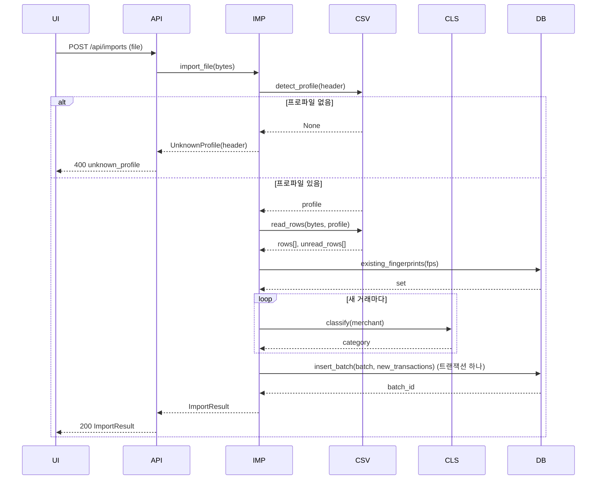
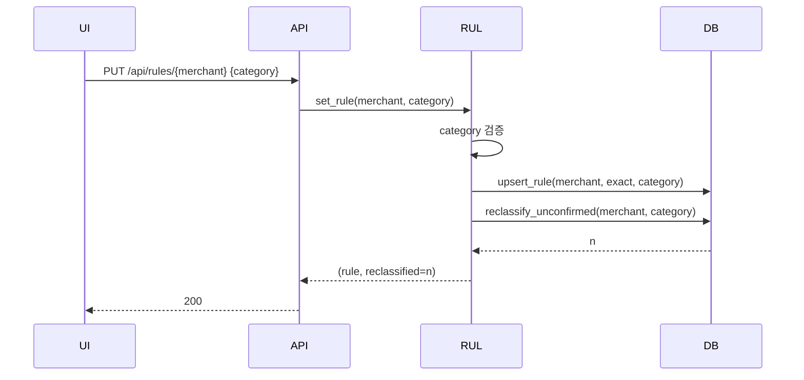
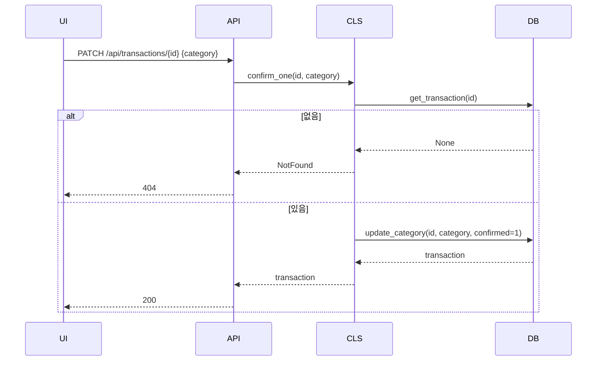
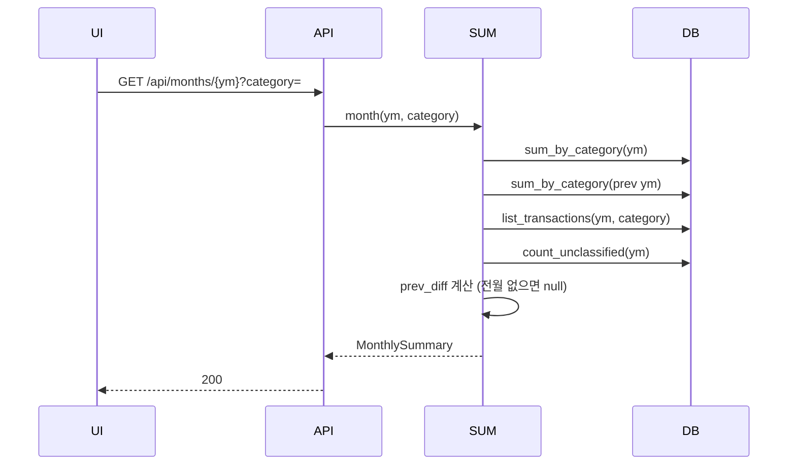

# SEQUENCE

## 0. 이 문서가 다루는 것

상태를 바꾸는 흐름 셋(가져오기 · 규칙 정하기 · 한 건 확정)과 조회 하나(월 요약)를 생명선으로 그린다. 저장 하나가 시퀀스 하나다. 생명선은 5단계 계층([[HB-INFRA-001#C2]])을 따른다: 브라우저 → 라우터 → 서비스 → 저장소.

### 0.1 생명선

| 생명선 | 약어 | 실체 | 종류 | 정의한 곳 |
|---|---|---|---|---|
| 브라우저 | UI | 정적 HTML + app.js | 화면 | [[HB-UI-001#UI-1]] 등 |
| 라우터 | API | FastAPI 라우터 `web/` | 웹 | [[HB-API-001#POST/api/imports]] 등 |
| 가져오기 서비스 | IMP | `ImportService` | 서비스 | HB-DOM-002(클래스 명세, 뒤에) |
| 분류 서비스 | CLS | `ClassifyService` | 서비스 | HB-DOM-002 |
| 규칙 서비스 | RUL | `RuleService` | 서비스 | HB-DOM-002 |
| 요약 서비스 | SUM | `SummaryService` | 서비스 | HB-DOM-002 |
| CSV 리더 | CSV | `infra/csv_reader` + 프로파일 | 인프라 | [[HB-DOM-001#ImportProfile]] |
| 저장소 | DB | SQLite 저장소 `infra/repo` | 인프라 | [[HB-INFRA-001#C2]] |

## 1. 대응표

| 시퀀스 | 유스케이스 | API | 바꾸는 것 |
|---|---|---|---|
| SEQ-1 | [[HB-UC-001#UC-H1]] · [[HB-UC-001#UC-S1]] | [[HB-API-001#POST/api/imports]] | transactions · import_batches |
| SEQ-2 | [[HB-UC-001#UC-H2]] · [[HB-UC-001#UC-H3]] | [[HB-API-001#PUT/api/rules/{merchant}]] | rules · transactions(미확정) |
| SEQ-3 | [[HB-UC-001#UC-H3]] | [[HB-API-001#PATCH/api/transactions/{id}]] | transactions 한 행 |
| SEQ-4 | [[HB-UC-001#UC-H4]] | [[HB-API-001#GET/api/months/{ym}]] | 없음(조회) |

#### SEQ-1 파일 가져오기

메모: 분류(CLS)는 규칙표를 한 번 메모리에 올려 두고 300건을 돈다([[HB-INFRA-001#C4]]). 저장은 batch와 거래를 한 트랜잭션으로 — 실패하면 아무것도 남지 않는다(UC-H1 최소 보장).

#### SEQ-2 가맹점 규칙 정하기

메모: upsert와 reclassify는 한 트랜잭션. `confirmed=1`인 행은 UPDATE 조건에서 빠진다([[HB-PRD-001#R4]]).

#### SEQ-3 거래 한 건 확정

#### SEQ-4 월 요약 조회

## 2. 되먹일 것

- SEQ-1에서 「읽지 못한 행」을 결과에 넣기로 했다 → [[HB-UC-001#UC-H1]] 확장 3a와 일치. PRD R1에는 없는 말이라 R1 인수기준에 「읽지 못한 행 수를 보인다」를 넣어야 한다.
- SEQ-2에서 규칙 저장과 재분류를 한 트랜잭션으로 묶었다 → 클래스 명세(HB-DOM-002)의 `RuleService.set_rule`이 저장소의 트랜잭션 경계를 갖는다.
- SEQ-4가 DB를 네 번 부른다 → 한 달 300건이라 괜찮다. 합치는 것은 하지 않는다.

## 3. 미결사항

- [ ] SEQ-1에서 파일이 5MB를 넘을 때 413을 라우터가 낼지 서비스가 낼지
